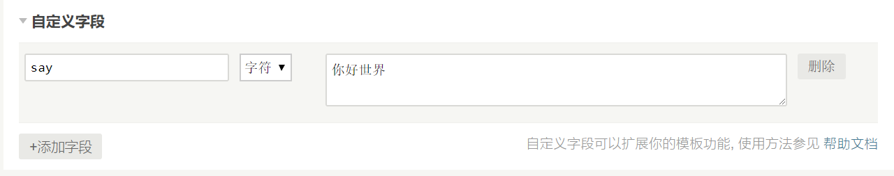

# 自定义字段

## 字段使用与调用

在**新建/编辑文章**界面时，下方点击**添加字段**，填写字段名与字段值，如图：



模板对应位置（index.php/post.php/page.php/archive.php等）加上如下代码

```php
<!--判断say字段的字段值是否存在-->
<?php if ($this->fields->say): ?> 
他说了：<?php $this->fields->say(); ?> 
<?php endif;?>
```

::: tip 输出结果

他说了：你好世界

:::

## 提示用户输入自定义字段

打开主题的`functions.php` ，填入如下函数（如果函数存在，请自行合并），就可以为你的主题增加一个自动绑定的输入框。

```php
function themeFields($layout) {
    $say = new \Typecho\Widget\Helper\Form\Element\Text('say', NULL, NULL, _t('留言'), _t('输入想说的话)'));
    $layout->addItem($say);
}
```

模板作者这样设置后，文章字段就不用用户手动增加了，而是默认就加好了，用户只需要提交 **字段值(自己想说的话)** 就可以了。

### 只在文章编辑页提示

```php
if($_SERVER['SCRIPT_NAME']=="/admin/write-post.php"){
    function themeFields($layout) {
        $say = new \Typecho\Widget\Helper\Form\Element\Text('say', NULL, NULL, _t('留言'), _t('输入想说的话)'));
        $layout->addItem($say);
    }
}
```

### 只在独立页面编辑页显示

```php
if($_SERVER['SCRIPT_NAME']=="/admin/write-page.php"){
    function themeFields($layout) {
        $say = new \Typecho\Widget\Helper\Form\Element\Text('say', NULL, NULL, _t('留言'), _t('输入想说的话)'));
        $layout->addItem($say);
    }
}
```

