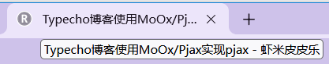

# 自定义标题

官方默认模板是这么自定义标题的。
```php
<title><?php $this->archiveTitle(array(
            'category'  =>  _t('分类 %s 下的文章'),
            'search'    =>  _t('包含关键字 %s 的文章'),
            'tag'       =>  _t('标签 %s 下的文章'),
            'author'    =>  _t('%s 发布的文章')
        ), '', ' - '); ?><?php $this->options->title(); ?></title>
```

输出结果：页面标题 - 站点名称



让我们来分解一下其中的语句，后一句大家都很明白，显示站点名称嘛，那前一句呢？其实前一句的标题包含三个参数：

```php
<?php $this->archiveTitle($split, $before, $end); ?>
```

| 参数名称 | 默认值 | 简介                              |
| -------- | ------ | --------------------------------- |
| $split   | »      | 多级菜单间的分隔符，如：2009 » 12 |
| $before  | »      | title 前显示的字符                |
| $end     |        | title 后显示的字符                |

## 建议

其实官方默认这样就已经很好了，但是如果有seo优化需要建议在后面再加上页码信息，如：

```php
<?php $this->archiveTitle(array(
            'category'  =>  _t('分类 %s 下的文章'),
            'search'    =>  _t('包含关键字 %s 的文章'),
            'tag'       =>  _t('标签 %s 下的文章'),
            'author'    =>  _t('%s 发布的文章')
        ), '', ' - '); ?><?php $this->options->title(); ?><?php if($this->getCurrentPage()>1) _e("第 %d 页", $this->getCurrentPage()); ?>
```

## 注意
本页看到的`_t`和`_e`都是 Typecho 内置的函数，用于多语言输出文本。详见[文本输出和多语言](i18n.md)
```php
<?php
$localized_text = _t($format, $arg1, $arg2, ..., $argN);
$localized_text = _e($format, $arg1, $arg2, ..., $argN);
```