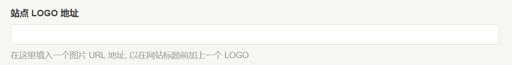

# functions.php

**function themeConfig($form)** 内的代码是模板设置功能

## 单行输入框选项：LOGO 设置

```php
$logoUrl = new \Typecho\Widget\Helper\Form\Element\Text(
    'logoUrl',
    null,
    null,
    _t('站点 LOGO 地址'),
    _t('在这里填入一个图片 URL 地址, 以在网站标题前加上一个 LOGO')
);

$form->addInput($logoUrl); // 添加选项到表单
```

`\Typecho\Widget\Helper\Form\Element\Text`一共有5个参数，

1. 第一个参数是选项key，只能是字符串，方便在模板中调用
2. 第二个填`NULL`就行
3. 第三个参数是默认值
4. 第四个选项是选项标题
5. 第五个参数是选项附加描述

PS：`_t()`是 Typecho 中多语言字符处理函数。

上边代码就是在模板设置处添加一个 Logo 设置，可以添加一个图片地址作为 Logo



添加好了通过`$this->options->logoUrl`调用图片，不过习惯性调用如下：

```html
<!--判断logo已被设置-->
<?php if ($this->options->logoUrl): ?>
<!--给logo图片加上本站超链接-->
<a id="logo" href="<?php $this->options->siteUrl(); ?>">
  <!--显示logo-->
  options->logoUrl() ?>"
    alt="<?php $this->options->title() ?>"
  />
</a>
<?php endif; ?>
```

此处对应`header.php`中的 logo 显示。

## CHECKBOX选项：显示开关

```php
$sidebarBlock = new \Typecho\Widget\Helper\Form\Element\Checkbox(
    'sidebarBlock',
    [
        'ShowRecentPosts'    => _t('显示最新文章'),
        'ShowRecentComments' => _t('显示最近回复'),
        'ShowCategory'       => _t('显示分类'),
        'ShowArchive'        => _t('显示归档'),
        'ShowOther'          => _t('显示其它杂项')
    ],
    ['ShowRecentPosts', 'ShowRecentComments', 'ShowCategory', 'ShowArchive', 'ShowOther'],
    _t('侧边栏显示')
);

$form->addInput($sidebarBlock->multiMode()); // 添加选项到表单
```

`\Typecho\Widget\Helper\Form\Element\Checkbox`同样也有5个参数

1. 第一个参数是选项key，只能是字符串，方便在模板中调用
2. 第二个参数是选项列表，必须是数组，key是值，value是显示文本
3. 第三个参数是默认值，同样必须是数组，存放默认启用的key值数组
4. 第四个选项是选项标题
5. 第五个参数是选项附加描述

调用的话，这里拿 ShowCategory 举例，如果勾选它

```php
<?php if (!empty($this->options->sidebarBlock) && in_array('ShowCategory', $this->options->sidebarBlock)): ?>
勾选了就会显示这里的文字
<?php endif; ?>
<!-- 因为 Checkbox 保存的是数组，所以必须使用 in_array 函数判断是否勾选了该选项 -->
```

这里对应的是`sidebar.php`中的最新文章，最新评论，文章分类，归档等显示开关。

## 其他选项
默认主题只提供了两种选项，这里简单介绍其他选项类型。
### 多行输入框
顾名思义，可以输入多行文本的输入框
```php
$header_html = new \Typecho\Widget\Helper\Form\Element\Text(
    'header_html',
    null,
    null,
    _t('输入头部附加 html 代码'),
    _t('在这里输入的 html 会附加到 header 中，可以填入统计代码，Google 广告代码等')
);

$form->addInput($header_html); // 添加选项到表单
```
参数功能和单行输入框选项一样。
调用方式
```php
<?php 
if ($this->options->header_html)
  $this->options->header_html();
?>
```
## 选项值如何获取？
在 default 主题里，你能搜索到`$this`的地方，都可以通过`$this->options->选项key`的方式获取，如果在没有`$this`的地方，可以通过`Helper::options()->选项key`这样来获取比如 logo 地址：
```php
<!--判断logo已被设置-->
<?php if (Helper::options()->logoUrl): ?>
<!--给logo图片加上本站超链接-->
<a id="logo" href="<?php Helper::options()->siteUrl(); ?>">
  <!--显示logo-->
  logoUrl() ?>"
    alt="<?php Helper::options()->title() ?>"
  />
</a>
<?php endif; ?>
```
## 其他说明

参考以上代码，照葫芦画瓢，可以增加自己需要的模板设置。
