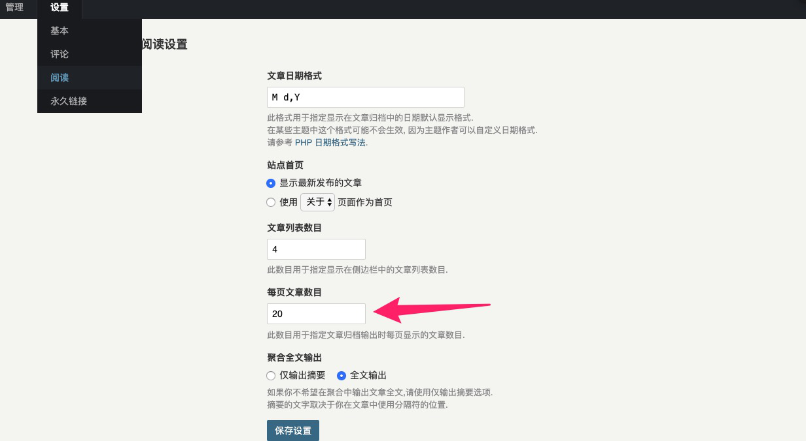
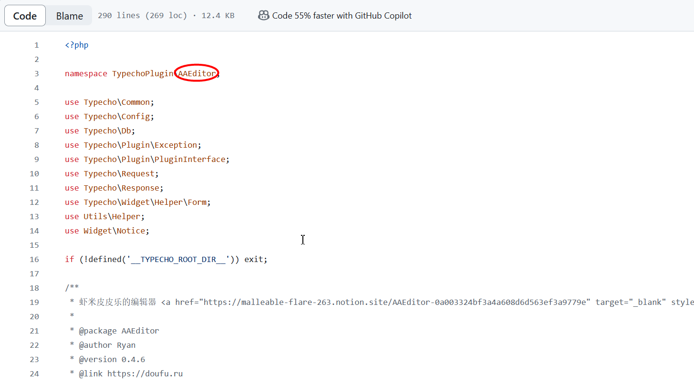
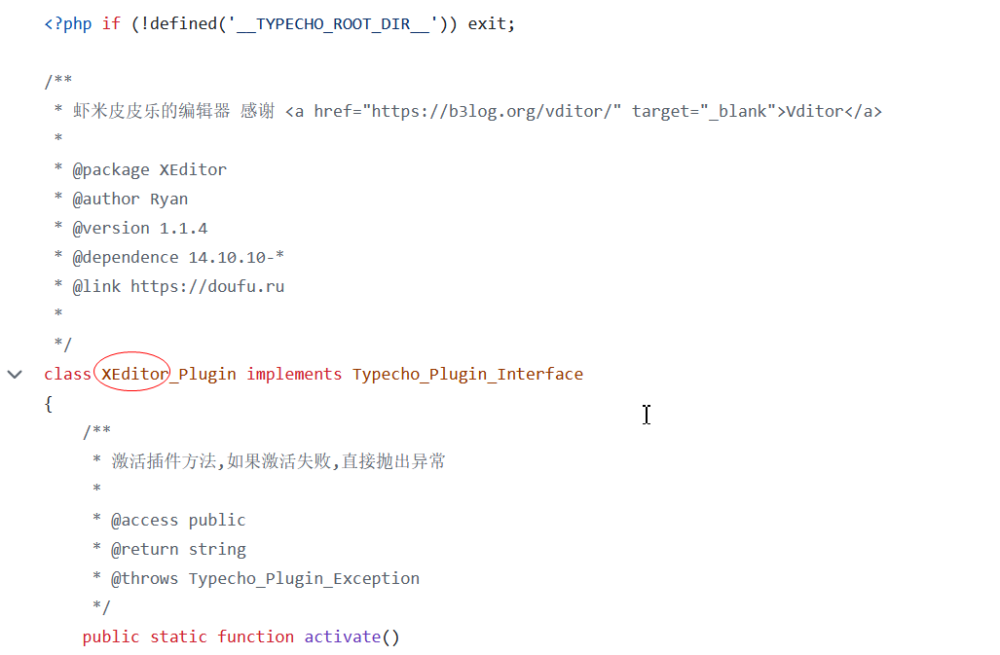
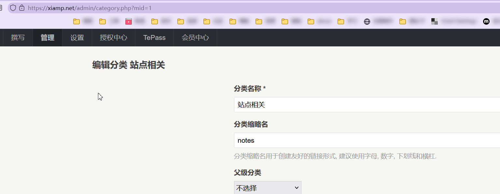
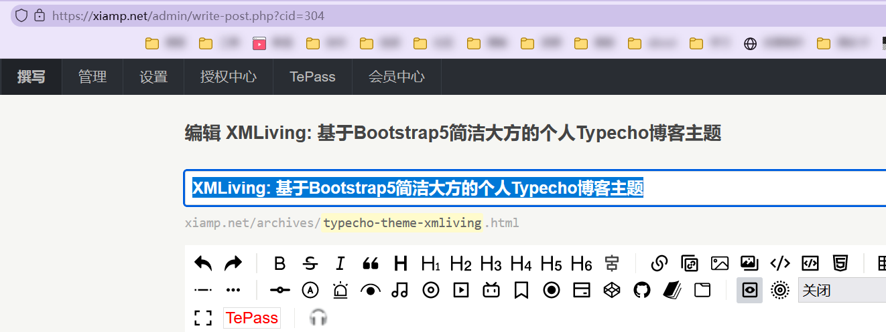
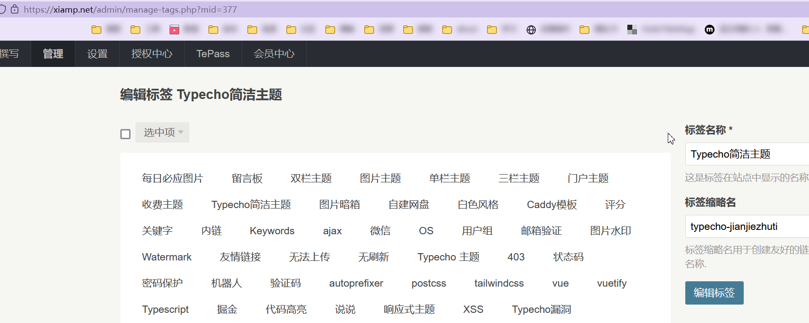
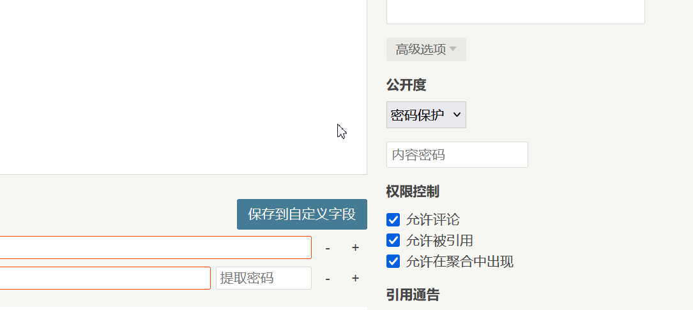
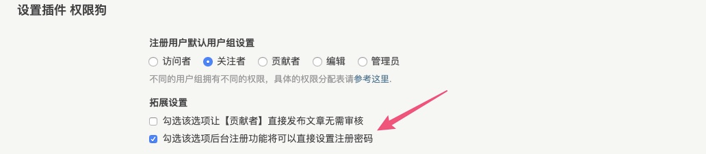

# 常见问题

## 博客首页怎么只显示 5 篇文章？

答：在 **typecho** 的后台，设置 -> 阅读 里面可以设置首页文章数量，默认 5 篇。



## 编辑器怎么居中文字，怎么给文字设置颜色？

# 常见问题

## 博客首页怎么只显示 5 篇文章？

答：在 **typecho** 的后台，设置 -> 阅读 里面可以设置首页文章数量，默认 5 篇。


## 编辑器怎么居中文字，怎么给文字设置颜色？

答：typecho 默认的是 markdown 编辑器，本身不支持这些功能，可以换用其他编辑器插件！或者使用 html 语句实现！

## 怎么在文章里使用 html 语句？

答：使用如下格式书写即可

```markdown
!!!
你的 html 语句
!!!
```

## 如何修改 Gravatar 头像 / 自己的评论头像如何修改？

你在评论时展示的头像为 `Gravatar` 头像。`Gravatar` 是一个头像服务，他通过你评论时留下的邮箱进行匹配。因此注册此服务时需要注意注册时使用的邮箱。
你可以通过点击：控制台 -> 个人设置 -> 点击左侧的头像 进入 `Gravatar` 注册账号并上传头像。

## 如何设置网站图标 favicon

默认情况下，在网站根目录里放 `favicon.ico` 文件即可， 百度很多在线工具都可以将图片转为 ico 格式的。

## 插件启动后报错 Database Error？

`typecho`要求插件文件夹名字与插件类名一直，一般这个报错就是文件名不对，可以看插件作者的安装说明，如果没有说明也可以打开插件文件夹下的`Plugin.php`文件，然后截图圈出部分就是正确的插件文件夹名字。



如果没有`namespace`这一行，那说明插件时用 1.1 的标准开发的，可以参照这张图片



## 什么是分类 mid，标签 mid，文章 cid？

进入编辑分类的页面，地址栏里结尾显示的数字即为分类`mid`



进入编辑文章的页面，地址栏里结尾显示的数字即为文章`cid`



进入编辑标签的页面，地址栏里结尾显示的数字即为标签`mid`



## 模板文件夹已经传到模板目录了，但是后台不显示？

答：一般出现这个问题有两个原因，一个是模板文件夹里文件缺失了`index.php`，说明你模板文件传丢了部分，建议重新上传；二可能是模板文件夹出现了套娃的情况，就是文件夹打开还有层文件夹。

## 文章怎么隐藏？怎么设置密码？

在编辑文章页面，右下角有个高级选项，点击它即可设置



## typecho 注册时无法设置密码？

typecho 不知道从什么时候开始注册就采用随机密码，然后让用户自行修改密码的策略了，本质上来说这样确实更加安全了，但是用户忘密码的情况更多了，所以有人就开发了格插件，安装启动【权限狗】插件，然后在设置里勾选这里保存设置即可


