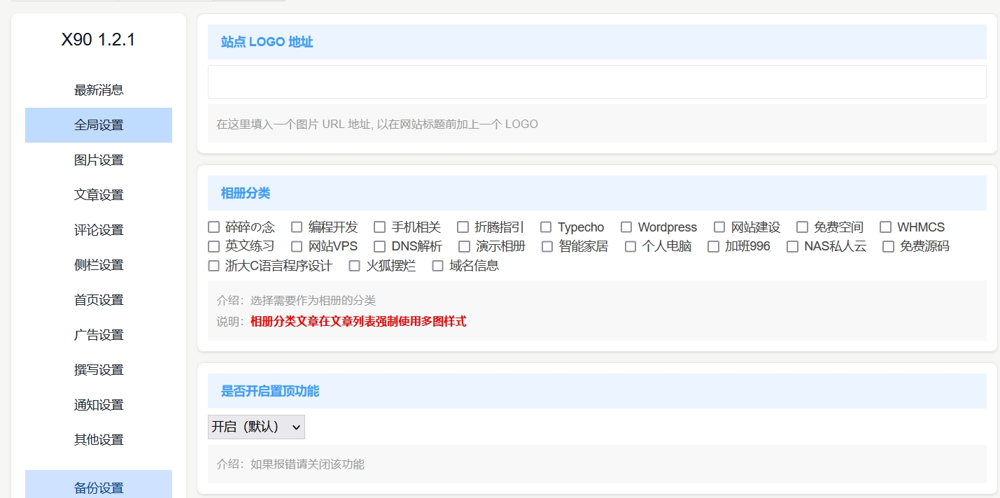

# Typecho主题选项定制

在 Typecho 官方的主题开发文档中，很少有关于文章自定义字段和主题设置相关的开发说明，这里写一下我的经验。

## 文章自定义字段

文章自定义字段定义后会显示在文章编辑界面的编辑框下方，用户可以使用定义好的选项来设置每篇文章的偏好，在输出文章的时候可以调用用户的设置，实现一些个性化功能。

文章自定义字段需要在主题目录下的 `functions.php` 文件中的 `themeFields` 函数中定义。

### input 输入框

下面定义一个 `input` 输入框：

```php
function themeFields($layout) {
    $thumb = new Typecho_Widget_Helper_Form_Element_Textarea(
        'thumb',
        NULL,
        NULL,
        _t('自定义缩略图（非必填）'),
        _t('填写时：将会显示填写的文章缩略图 <br>
             不填写时：<br>
                1、若文章有图片则取文章内图片 <br>
                2、若附件有图片，则自动遍历附件中的图片，如果不足，模板图片补全 <br>
                3、若文章无图片，且附件中无图片，·则取模板图片 <br>
             注意：多个缩略图时换行填写，一行一个（仅在四图模式下生效）')
    );
    $layout->addItem($thumb);  // 添加输入框到表单
}
```

`Typecho_Widget_Helper_Form_Element_Text` 的第一个参数是字段名。第二个参数是设计来给输入框设置`attribute`的，但是看源码并没有实现。第三个参数是默认值。第四个参数是提示信息，会显示在输入框关联的 `label` 标签中。第五个参数是更详细的提示信息，会显示在输入框下方。

在输出文章的时候可以通过 `$this->fields->thumb()` 输出自定义字段的内容，其中的 `image` 就是字段名称。如果要判断字段是否有内容，请参考下面

```php
<?php
    $thumb = $this->fields->thumb;
    if (isset($thumb) && strlen(trim($thumb))) {
        // 这里就是字段有内容
        ?>
            fileds->thumb(); ?>" />
        <?php
    }
```

### select 下拉选择

下面定义一个 `select` 下拉选择：

```
$mode = new Typecho_Widget_Helper_Form_Element_Select(
    'mode',
    array(
        'single' => _t('默认模式'),
        'multiple' => _t('四图模式'),
        'none' => _t('无图模式')
    ),
    'single',
    _t('文章列表缩略图显示方式'),
    _t('介绍：用于设置当前文章在首页和搜索页的显示方式</ br>
            注意：相册文章强制四图模式')
);
$layout->addItem($mode);
```

注意！只要是文章的自定义字段都需要写在 `themeFields` 函数内，多个字段也只需要写在一个 `themeFields` 函数内。

`Typecho_Widget_Helper_Form_Element_Select` 的第一个参数是字段名称。第二个参数是下拉选择的内容，需要传入一个数组，目前Typecho 1.2**必须为数组**，不然会导致各种奇奇怪怪的问题。第三个参数是默认值，默认值的类型为字符串，需要传入一个数组的键名。第四个参数是 `label` 标签关联的提示信息。第五个参数是更详细的提示信息。

### radio 选择

和 Select 差不多，把`Typecho_Widget_Helper_Form_Element_Select`改成`Typecho_Widget_Helper_Form_Element_Radio`，两者只是外观不一样

## 主题设置字段

主题设置字段定义后会显示在主题的外观设置页，用户可以使用定义好的选项来设置主题的外观和功能。

主题设置的字段需要在主题目录下的 `funcions.php` 中的 `themeConfig` 函数中定义。

### input 输入框

下面定义一个 `input` 输入框：

```php
function themeConfig($form) {
    $logoUrl = new Typecho_Widget_Helper_Form_Element_Text('logoUrl', null, null, _t('站点 Logo 地址'), _t('Logo 会显示在标签页的标题前面。'));
    $form->addInput($logoUrl);  // 添加输入框到表单
}
```

主题设置字段的 `Typecho_Widget_Helper_Form_Element_Text` 参数和文章自定义字段的 `Typecho_Widget_Helper_Form_Element_Text` 的参数是一样的。

主题设置字段可以在任何一个页面使用 `$this->options->logoUrl()` 输出，判空操作和主题自定义字段是差不多的。

```php
<?php
    $logoUrl = $this->options->logoUrl;
    if (isset($logoUrl) && strlen(trim($logoUrl))) {
        // 这里就是该设置不为空
        ?>
            options->logoUrl(); ?>" />
        <?php
    }
```

### textarea 输入框

下面定义一个 `textarea` 输入框：

```php
function themeConfig($form) {
    $edit = new Typecho_Widget_Helper_Form_Element_Textarea(
        'XCustomReplacement',
        NULL,
        NULL,
        _t('全局链接替换功能'),
        _t('介绍：可以使用全局替换功能将静态资源链接替换为自定义 CDN 加速链接<br />
            格式：源文本：https://baidu.com/usr 替换为：https://google.com/usr<br />
            说明：上面的格式示例是将 https://baidu.com/usr 替换为 https://google.com/usr<br />
            操作：点击%s添加', XIcon::get('add-line'))
    );
    $edit->setAttribute('class', 'x-item x-global'); // 给选项增加 class，增加 class 以后你就可以方便的通过 css 细化样式，比如有的输入框需更高的初始高度
    $edit->setAttribute('x-sortable-config', sprintf("{ 'regex': '%s', 'replacement': '%s' }", _t("源文本"), _t("替换为"))); // 这是我用的，你们不需要关心
    $form->addInput($edit);
}
```

注意！所有的主题设置字段都需要写在 `themeConfig` 函数中，多个字段也只需要写在一个 `themeConfig` 函数中。

`Typecho_Widget_Helper_Form_Element_Textarea` 的参数和 `input` 输入框的参数是一样的。

`textarea` 的输出和查询和上面的 `input` 是一样的。

通过`setAttribute`方法设置`class`就可以有更多玩法了。下面是我的主题的设置界面预览。



### checkbox 复选框

下面定义一组 `checkbox` 复选框：

```php
function themeConfig($form) {
    $sidebarBlock = new Checkbox(
        'sidebarBlock',
        [
            'ShowRecentPosts' => _t('显示最新文章（首页强制隐藏）'),
            'ShowRecentComments' => _t('显示最近回复'),
            'ShowCategory' => _t('显示分类'),
            'ShowArchive' => _t('显示归档'),
            'ShowOther' => _t('显示其它杂项')
        ],
        ['ShowRecentComments', 'ShowCategory', 'ShowArchive', 'ShowOther'],
        _t('侧边栏显示')
    );
    $sidebarBlock->setAttribute('data-group', 'aside');
    $form->addInput($sidebarBlock->multiMode());
}
```

`Typecho_Widget_Helper_Form_Element_Checkbox` 的第一个参数是字段名。第二个参数是复选框的内容，需要传入一个数组。第三个参数是复选框的选中状态，需要传入一个数组（**如果不传入数组会导致无法保存设置**），数组的内容就是第二个参数中数组的键名。第四个参数是复选框组的标题，会显示在复选框的上方。

注意！调用`multimode`方法会给该checkbox增加一个`multiline`的类名，选项只会一行显示一个，不调用就会记载一起，节省空间。

如果需要判断复选框的选中状态可以使用 `in_array` 函数来查找 `$this->options->sidebarBlock` 的选项。

下面判断 `显示最新回复` 是否选中 ：

```php
if (is_array($this->options->sidebarBlock) && in_array('ShowRecentComments', $this->options->sidebarBlock)) {
    //  返回 true
}
```

### 自定义HTML

有时候我们不仅仅需要增加输入框，还有别的奇奇怪怪的东西，那么则需要一个方便自定义HTML的Element，下面的代码就是定义一个专门用于写入HTML的Element，添加到`functions.php`的`themeConfig`函数前面即可

```php
class ThemeConfigHtml extends Typecho_Widget_Helper_Layout
{
    public function __construct($html)
    {
        $this->html($html);
        $this->start();
        $this->end();
    }

    public function start()
    {
    }

    public function end()
    {
    }
}
```

然后就可以通过下面的方法写入 HTML

```php
$notice = new ThemeConfigHtml('<strong>主题巴拉巴拉</strong>');
$form->addItem($notice);
```

注意：不能通过`echo`直接输出HTML，这样会导致这段代码有几率出现在前台（与主题设计相关）

## 主题选项备份

Typecho切换主题会清空主题数据，只好手动增加一个备份功能。原来在选项数据表里，主题设置保存到键名`name`，键值为`theme:主题名称`哪一行，点击**备份设置**会备份到到到`theme:主体名称_backup`那一行，点击**还原设置**会从`theme:主体名称_backup`那一行还原数据。

```php
function () {
	$db = Typecho_Db::get();
	$widget = Typecho_Widget::widget('Widget_Archive');
    /** @var Notice $notice */
    $request = $widget->request;
    $notice = Typecho_Widget::widget('Widget_Notice');
    $response = $widget->response;
    $themeName = Helper::options()->theme;
    // 查询主题数据
    $themeDataRow = $db->fetchRow($db->select()->from('table.options')->where('name = ?', "theme:$themeName"));
    $themeData_backupRow = $db->fetchRow($db->select()->from('table.options')->where('name = ?', "theme:{$themeName}_backup"));
    $themeData = empty($themeDataRow) ? null : $themeDataRow['value'];
    $themeData_backup = empty($themeData_backupRow) ? null : $themeData_backupRow['value'];
    if (isset($request->type)) {
        if ($request->type == 'backup') {
            if ($db->fetchRow($db->select()->from('table.options')->where('name = ?', "theme:{$themeName}_backup"))) {
                $updateQuery = $db->update('table.options')->rows(['value' => $themeData])->where('name = ?', "theme:{$themeName}_backup");
                $db->query($updateQuery);
                $notice->set(_t('备份已更新!'), 'success');
                $response->goBack();
            } else {
                if ($themeData) {
                    $insertQuery = $db->insert('table.options')->rows(['name' => "theme:{$themeName}_backup", 'user' => '0', 'value' => $themeData]);
                    $db->query($insertQuery);
                    $notice->set(_t('备份完成!'), 'success');
                    $response->goBack();
                }
            }
        } elseif ($request->type == 'restore') {
            if ($themeData_backup) {
                $updateQuery = $db->update('table.options')->rows(['value' => $themeData_backup])->where('name = ?', "theme:$themeName");
                $db->query($updateQuery);
                $notice->set(_t('检测到模板备份数据，恢复完成'), 'success');
            } else {
                $notice->set(_t('没有模板备份数据，恢复不了哦！'), 'error');
            }
            $response->goBack();
        } elseif ($request->type == 'delete') {
            if ($themeData_backup) {
                $deleteQuery = $db->delete('table.options')->where('name = ?', "theme:{$themeName}_backup");
                $db->query($deleteQuery);
                $notice->set(_t('删除成功！！！'), 'success');
            } else {
                $notice->set(_t('不用删了！备份不存在！！！'), 'error');
            }
            $response->goBack();
        }
    }
    $basicUrl = Typecho_Common:url('options-theme.php?type=', Helper::options()->adminUrl);
    $notice = new ThemeConfigHtml('<a href=" ' . $basicUrl . 'backup">' . _t("备份设置") . '</a><a href=" ' . $basicUrl . 'restore">' . _t("还原备份") . '</a><a href=" ' . $basicUrl . 'delete">' . _t("删除备份") . '</a>');
	$form->addItem($notice);
}
```